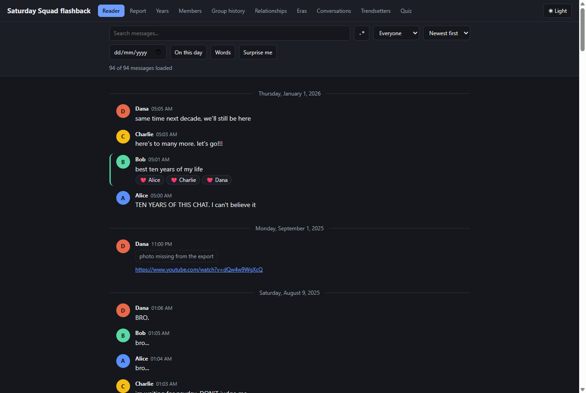
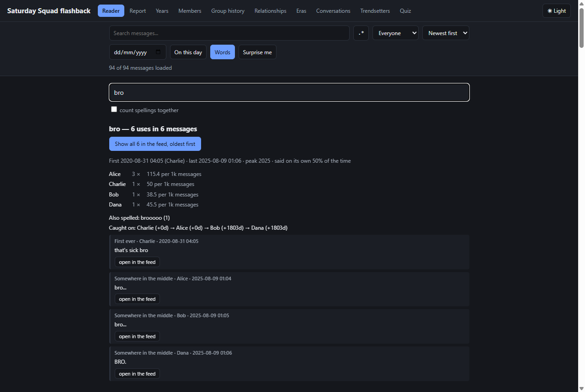

# chat-flashback

Turns a Facebook Messenger export into a set of reports, charts and web pages, plus a
local reader that lets you scroll the whole chat like a messaging app.

Everything runs on your machine. Nothing is uploaded anywhere.



## Contents

- [Quick start](#quick-start)
- [What you get](#what-you-get)
- [Options](#options)
- [Common tasks](#common-tasks)
- [The chat reader](#the-chat-reader)
- [How the harder numbers are worked out](#how-the-harder-numbers-are-worked-out)
- [Privacy](#privacy)
- [Examples and sample data](#examples-and-sample-data)
- [Tests](#tests)

## Quick start

Four steps. You need Python 3.8 or newer.

**1. Install**

```bash
pip install -r requirements.txt
```

Or install it as a package, which gives you a `chatflashback` command:

```bash
pip install .
```

Two optional extras add features. Without them the tool skips those sections and
keeps going.

```bash
pip install ".[full]"   # vaderSentiment for mood, wordcloud for word clouds
```

**2. Download your Messenger data**

1. Facebook Settings, then Your information, then Download your information.
2. Select Messages and the chats you want.
3. Set the format to JSON and the media quality to Low.
4. Download the zip and extract it.

The folder you want holds `message_1.json`, `message_2.json` and so on. It sits at
`youraccount_.../your_activity_across_facebook/messages/inbox/<thread>/`.

**3. Run it**

```bash
python analyze_chat.py --input data --output output
```

Point `--input` at one thread folder, or at the whole `messages/inbox/` folder to do
every thread in one go.

**4. Open the report**

Open `output/<thread>/report.html` in a browser. It is one self-contained file with
every table and chart in it, so you can send it to somebody as is. The other pages
sit next to it and are linked from the bar across the top.

To read the chat itself instead:

```bash
python analyze_chat.py --input data --serve
```

That starts a reader on `http://127.0.0.1:8080`.

## What you get

Running the tool writes everything into `output/<thread>/`.

### The report

`report.html` and `summary.md` hold the same numbers, one as a web page and one as
plain text. Add `--json` to also get `summary.json`.

Inside: yearly recaps with the top member, word and record day of each year. Member
personalities with signature words, favourite emojis, peak hour and night-owl share.
Reaction dynamics. A response-speed leaderboard with median reply time and the share
of each member's turns that nobody answered. Swear-word counts per member. Who starts
conversations, who ghosts, who monologues. Question dynamics: who asks, who answers,
who gets left on read. Emoji counts and a timeline of favourite emojis. Topic words
per year. Repeated phrases that look like inside jokes. Message-length and word trends
over time. Mood per member and per year, if `vaderSentiment` is installed. A weirdest
statements reel of all-caps, 3am and punctuation-spiral messages. A media leaderboard
for photos, stickers, GIFs, videos, audio and files.

Around 40 PNG charts come with it, including a GitHub-style activity heatmap, pair
matrices of who replies to and reacts to whom, hourly radars, word clouds and a
sleep-schedule grid of everyone's posting hours year by year.

### The pages beside the report

| Page | What is on it |
|---|---|
| `year_in_review.html` | An index, plus `year_<year>.html` for every year |
| `members.html` | An index of everyone, linking to their pages |
| `group_history.html` | Every name the group gave itself and every nickname, as dated ranges |
| `member_<name>.html` | One per member: their years, their words, who they answer, their most-reacted messages |
| `relationships.html` | Pairs by year, pairs that drifted apart, who breaks the silence, who gets the last word |
| `eras.html` | The chat cut into periods, each named after the word it made its own |
| `sessions.html` | Conversations: who opens them, who ends them, how long they run, the longest silences |
| `trendsetters.html` | Who says a word first and then watches everybody else start saying it |
| `quiz.html` | Guess who said this, built from each member's signature words |

### The reader

`--serve` opens a Messenger-style reader on localhost:

- Infinite-scroll feed grouped by day, newest or oldest first
- Sender colours, inline reactions, reply threading and "N years ago" badges
- Photo and GIF thumbnails, inline video and audio players, download links for files
- Search across every message, with a `.*` regex toggle and per-member filters
- Jump to a date, an "On this day" view across the years, and a "Surprise me" button
- A word explorer behind the Words button
- Every page above in one navigation bar, in one theme that follows your system
  until you pick one and is then remembered
- Searches, filters and jumps live in the address bar, so the back button undoes
  them and a view can be bookmarked or shared

### Handling of awkward exports

Newer export fields (`gifs`, `videos`, `audio_files`, `files`, `polls`, `is_taken_down`)
are read, and messages that appear in more than one file are de-duplicated.

Copy-paste floods are capped. Each word or emoji counts at most three times per
message, so one pasted wall of the same word cannot decide the top words or what a
year was about. Volume stats still count every keystroke, and the totals say how many
floods there were.

Members that are obviously software, such as `Meta AI`, are labelled `(bot)` and kept
out of the human awards.

## Options

| Flag | What it does |
|---|---|
| `--input`, `-i` | A thread folder or an export `messages/` folder (default: `data/`) |
| `--output`, `-o` | Where to write everything (default: `output/`) |
| `--anonymize` | Replace names with Person A, Person B everywhere, including inside quoted messages |
| `--track` | Words or phrases to count and chart, e.g. `--track "lol, bro"` |
| `--track-file` | The same, from a file, one per line (`#` for comments) |
| `--names` | Names the export does not list, such as a deleted account showing as "Facebook user", so they do not read as topic words |
| `--stopwords-file` | Extra words to ignore, one per line. The built-in list is English only |
| `--year` | Analyze one year only, e.g. `--year 2017` |
| `--top` | How many rows in each leaderboard (default: 10) |
| `--trend-band` | How often a word must be used to count as one somebody started, as `min,max` (default: `20,2000`) |
| `--json` | Also write `summary.json` |
| `--serve` | Start the reader instead of writing reports |
| `--port` | Port for `--serve` (default: 8080) |
| `--no-index` | Skip the word index when serving. Starts instantly, but the word explorer is off |
| `--tz` | Timezone, e.g. `+03:00` or `America/New_York`. Messenger timestamps are UTC and the default is your system timezone |
| `--config` | A JSON file holding any of these options |
| `--skip` | Skip analyses: `jokes`, `sentiment`, `wordcloud`, `topics`, `narratives` |
| `--progress` | Print which phase is running |
| `--incremental` | Skip threads that have not changed since the last run |
| `--check` | Validate the export instead of analyzing it |

## Common tasks

### Share a report without real names

```bash
python analyze_chat.py --input data --anonymize
```

Names become Person A, Person B in every chart, table and quoted message.

### Chats that mix languages

The built-in stopword list is English only. In a chat that mixes languages, the other
language's function words take over the top-word, topic and inside-joke sections.
A Hinglish list ships with the tool:

```bash
python analyze_chat.py --input data --stopwords-file stopwords/hinglish.txt
```

Any file works: one word per line, `#` for comments. Chat spelling is not standard, so
a word usually needs several entries (`mein`, `mei`, `mai`) before it stops showing up.

### Very large chats

The analysis holds everything in memory, so a chat with hundreds of thousands of
messages needs headroom. Two phases dominate. Inside jokes counts every 2 to 4 word
phrase and drives peak memory. Sentiment is the slowest. Drop both if a run is too
heavy:

```bash
python analyze_chat.py --input data --skip jokes,sentiment
```

Every other report, chart and page is still written.

### Count your own words

```bash
python analyze_chat.py --input data --track "shawarma, bro"
```

Each term gets a row in the report and a line on a chart. `--track-file` reads a longer
list from a file.

### Use a config file instead of flags

```json
{
  "input": "data",
  "output": "out",
  "top": 15,
  "json": true,
  "track": "lol, bro"
}
```

```bash
python analyze_chat.py --config config.json
```

Flags on the command line still win over the file.

### Re-run without redoing everything

`--incremental` stores a fingerprint of each thread (file names, sizes, modification
times) in `output/.chatflashback_state.json` and skips threads that have not changed.
Changing a flag such as `--year` or `--top` forces a re-run.

### Check an export before analyzing it

```bash
python analyze_chat.py --input data --check
```

Per thread, it reports message types, unknown `type` values and unknown message keys
so a new export format is easy to spot, plus empty messages, attachments missing from
disk, duplicate messages and gaps of over 90 days between message files. Add `--json`
to also write `check.json`. It never analyzes and always exits 0.

## The chat reader

```bash
python analyze_chat.py --input <thread> --serve
```

The server listens on `127.0.0.1` only, with no authentication, so it is not reachable
from your network.

If you have already run the analysis, `--serve` also serves every page it wrote, and
they gain links the files on disk do not have: quoted messages on the Conversations
page and answers in the quiz get an "open" link that jumps the reader to that exact
moment, and each member page links to that member's filtered feed. Open the same files
straight off disk and those stay plain text, since there is no reader to open.

### Word explorer



Type a word into the panel behind the Words button. You get total uses and how many
messages they land in, a per-member table with a per-1,000-messages rate so a quiet
member who says it constantly is not buried under a chatty one, the year it peaked,
how often it is sent on its own, whether it pulls more reactions than average, who
said it first and how long everybody else took to pick it up, the words that sit
beside it more often than chance predicts, and example messages with a button that
jumps the feed to that moment.

Matching is exact. `bruh` does not quietly include `bruhh`. Spellings that differ only
in held-down letters are listed separately, and a "count spellings together" box folds
them into the totals. Autocomplete suggests words by how often they are used.

Type more than one word and it becomes a phrase, counted only where those words sit
side by side, so `full send` ignores "send me the full list". Emoji are indexed as
words, so `😂`, `😂😂` and `lol 😂` all work. Punctuation and capitals are ignored, and
a phrase can be made entirely of stopwords (`the end` is a fair question even though
`the` is not).

"Show all N in the feed" turns the reader into every message holding that word, oldest
first. Click one and the feed opens the conversation around it.

The index is built at startup and kept in memory. On a 1.79M-message chat that takes
about 30 seconds and peaks near 180 MB while building, for 140,755 distinct words. A
lookup then takes milliseconds for an ordinary word and up to about 3 seconds for one
of the most common ones, since every statistic is computed on demand over the messages
that matched. Phrases need no index of their own, so `in the` came back in 1.0 s and
`what the hell` in 0.04 s on the same chat. Pass `--no-index` to skip the build if you
only want to read.

### Where the reader keeps its data

Parsed messages go into a SQLite file at `output/.reader/<thread>.sqlite3`, which
answers the feed, the date jump, "on this day", the random memory and search. The file
is keyed on the same fingerprint `--incremental` uses, plus `--tz` and `--anonymize`,
since both change what gets stored. Anything else rebuilds it.

The difference shows on the second start. With `--no-index` the export is not parsed at
all: the reader opens the file and serves. Without it, the messages are parsed anyway
because the word explorer needs them in memory. A half-written file is rebuilt rather
than trusted, because the "complete" marker is written last.

Search is a substring scan running inside SQLite, and reports the true match count
along with the first page of hits. It is deliberately not a full-text index: FTS5
matches whole tokens, so searching `tube` would stop finding `youtube.com`. On a
500k-row benchmark that is 0 hits against 358,453. The scan costs roughly 60 ms per
500k messages.

Media is served from the export folder only. Paths are resolved inside the thread
directory so nothing outside it can be read, and files stream with `Range` support so
video and audio can seek. Anything that is not an image, video or audio downloads
rather than rendering, since an export can contain `.html` or `.svg` attachments.

## How the harder numbers are worked out

Most of the report is a straight count. These are the ones with a rule behind them.

### Eras

A month opens a new era when the three months from it carry less than half or more
than double the messages of the three before it, or when fewer than a third of the
previous quarter's top words survive into this one. Quarters too small to have a
character of their own cannot open an era, and eras shorter than six months are merged
into their neighbour.

Each era is named after the word it uses most out of proportion to the rest of the
chat, which is not its most common word. TF-IDF was tried first and named four eras out
of five after the chat's single commonest word.

Underneath sits the plainest version of the same story: the words the chat first said
and last said in each year.

### Relationships

A pair interacts when one answers the other within an hour, or reacts to their message.
Those are counted per year.

A pair has drifted when its share of either member's own interaction moves by more than
half between the pair's peak year and the most recent year the export covers end to
end. Using the share, rather than the raw count, stops a pair reading as drifted when
the whole chat simply went quiet. Pairs under 100 interactions in their peak year are
left out.

The page also reports who speaks first after a day of silence, who gets the last word,
and whose messages go unanswered, as a share of their own messages so the loudest
member does not top the list by volume.

### Conversations

The chat is cut wherever nobody spoke for 30 minutes, the same gap the rest of the
report uses.

Openers and closers are given as a count and as a rate per 100 of that member's own
messages. The count alone just ranks by who talks most; the rate separates someone who
always speaks first from someone who is always there.

Conversation length is given as percentiles rather than an average, because the range
runs from two-message exchanges to all-nighters. Underneath sits the inverse: the
chat's longest silences and the message that broke each one.

### Trendsetters

Who introduces vocabulary that other people actually adopt, which is a different
question from who talks most.

For every word the chat used between 20 and 2,000 times, the tool takes whoever said it
first. The word counts as having caught on only once at least three other members said
it too.

Three rules keep the answer honest:

- A word first said in the chat's opening 90 days does not count. An export beginning is
  not the same as a word being new, and without this rule whoever talked most in month
  one "starts" thousands of words the chat had been saying for years.
- Bots are left out.
- The count is divided by how much each member says, per 1,000 of their own messages,
  so a chatty member cannot win on volume. Members under 100 messages are left out,
  since a rate needs a denominator worth dividing by.

On a small chat nothing reaches twenty uses. Lower the band with `--trend-band 3,50`
and the words still show even when nobody clears the leaderboard's floor.

### Quiz

A message qualifies only if it uses one of its sender's signature words, so the answer
is gettable rather than a coin flip. Messages that name somebody give the answer away
and are left out, as are bot messages. The three wrong answers are sampled by message
volume, so they are plausible for that era. It is seeded, so regenerating the report
does not reshuffle the questions.

### Group history

Messenger writes its own messages about the group: renames, nicknames, joins and
removals. They are dropped from the vocabulary, because otherwise "named the group"
ranks as an inside joke said by everyone for years. Read back, they are a record nobody
has seen. On a nine-year chat that was 520 group names and 369 nickname changes.
Nicknames are shown as dated ranges, since the question people ask is what somebody was
called in 2021, not when the name was set.

## Privacy

- All processing happens on your machine.
- `--anonymize` replaces real names everywhere, including names inside quoted messages.
- `--serve` binds to `127.0.0.1`, so the reader is never reachable from the network.
- Text that comes from the export, meaning thread titles, names and message bodies, is
  escaped everywhere it is rendered, in the reader and in the generated reports.
- `.gitignore` excludes `data/` and `output/`, so an export cannot be committed by
  accident.

## Examples and sample data

`sample_data/` holds a small synthetic thread, 94 messages across four members and nine
years. Run it to see the output without touching your own data:

```bash
python analyze_chat.py --input sample_data --track "shawarma, bro" --json --trend-band 3,50
```

`examples/` holds exactly that run, committed so you can look before installing
anything: `example_summary.md`, `report.html`, `summary.json`, every generated page,
and the charts. The band is lowered there because 94 messages never reach twenty uses
of a word.


## Tests

```bash
pip install -r requirements-dev.txt
python -m pytest
```

The suite takes about six minutes.

## License

MIT
